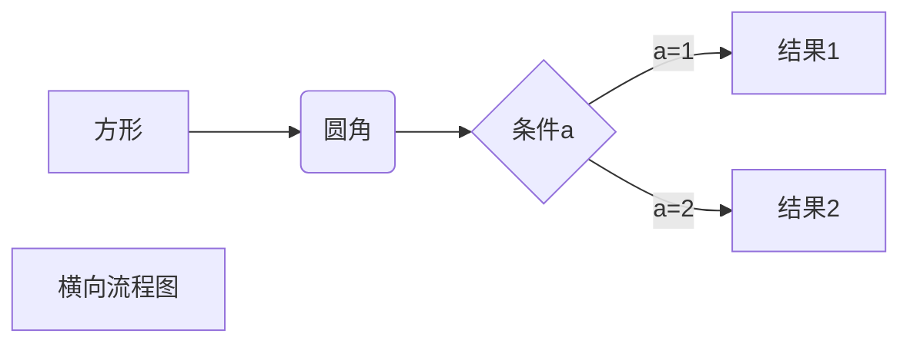

# 第一
## 第二
### 第三

软件工程导论
===========

软件项目管理   

*软件*
_斜体_
**粗体**
***粗斜体***
***

*****

----
---
--
- - -
~~百度~~

<u>下划线<u>

创建脚注[^RUNOOB].

[^RUNOOB]:刘亚飞

* first
* second
+ 1
+ 2
- 1
- 2
- 3


1. first
2. first
------


1. 第一项
    - 第一项中第一元素
    - 第二项中第二元素
2. 第二元素

------
> 区块引用
> > 第二层嵌套
> 1. 1
> 2. 2

-----------
* 引用
    > cainian  
    > aiji
*di
* 第一项
    > 菜鸟教程  
    > 学的不仅是技术更是梦想
* 第二项

-------
1. 第一种

`printf` 反引号

2. 第二种


    scanf


3. 第三种

```python
import pandas ad pd
```

------
1. 链接第一种

[刘亚飞](https://www.baidu.com)

2. 链接第二种

<https://www.google.com>


3. 高级链接

这是链接一[1]  
这是链接二[2]

[1]: http://www.google.com
[2]: http://www.baidu.com


|  表头   | 表头  |
| :----:  | ----  |
| 单元格  | 单元格 |
| 单元格  | 单元格 |
| dan    | dan  |

$$
\mathbf{V}_1 \times \mathbf{V}_2 =  \begin{vmatrix} 
\mathbf{i} & \mathbf{j} & \mathbf{k} \\
\frac{\partial X}{\partial u} &  \frac{\partial Y}{\partial u} & 0 \\
\frac{\partial X}{\partial v} &  \frac{\partial Y}{\partial v} & 0 \\
\end{vmatrix}
${$tep1}{\style{visibility:hidden}{(x+1)(x+1)}}
$$




